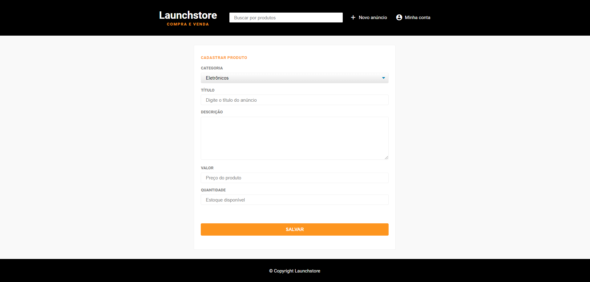

<h1 align="center">
    
</h1>

<h3 align="center">
  Launchstore
</h3>

## :rocket: Sobre o módulo

Aplicação dos conhecimentos adquiridos até então para criar uma espécie de ecommerce intitulado Launchstore. O módulo foi dividido da seguinte forma:

### Modelando dados  

- **Apresentação do projeto e ajustes inicias;**
- **Modelagem de dados com DBML;**
- **Foreign keys e contraints no SQL;**

### Layout básico da aplicação

- **Estrutura HTML do layout, header e footer;**
- **Estilizando layout, header e footer;**
- **Conhecendo display flex;**
- **Finalizando estilo do header;**

### Layout do formulário de cadastro

- **Construindo formulário de cadastro de produtos;**
- **Criando campos do formulário;**
- **Estilização base do formulário de cadastro;**
- **Estilizando campos do formulário;**
- **Criando seleção de instrutores;**
- **Select customizado;**
- **Finalizando estilo do formulário;**

### Cadastrando produtos

- **Conhecendo promises;**
- **Conhecendo async-await;**
- **Substituindo textos com expressão regular;**
- **Formatando moeda;**
- **Criando estratégia de máscara de campo;**
- **Corrigindo falha da modelagem de dados;**

### Atualizando e excluindo produtos

- **Formulário de atualização;**
- **Formatando preço do produto;**
- **Estilizando botões de atualizar e deletar;**
- **Funcionalidade de atualização de produtos;**
- **Excluindo produtos;**

Além dos módulos, um desafio foi proposto para aprimorar nossos conhecimentos no uso de Callbacks, Promises e Async/Await, jutamente com a elaboração de duas máscaras de input, uma para porcentagem e outra para CPF.

- **Desafio 6-1: Mini desafios** [:link:](https://github.com/Rocketseat/bootcamp-launchbase-desafios-06/blob/master/desafios/06-1-mini-desafios.md)

## :rocket: Resultados

### Feito durante as aulas

